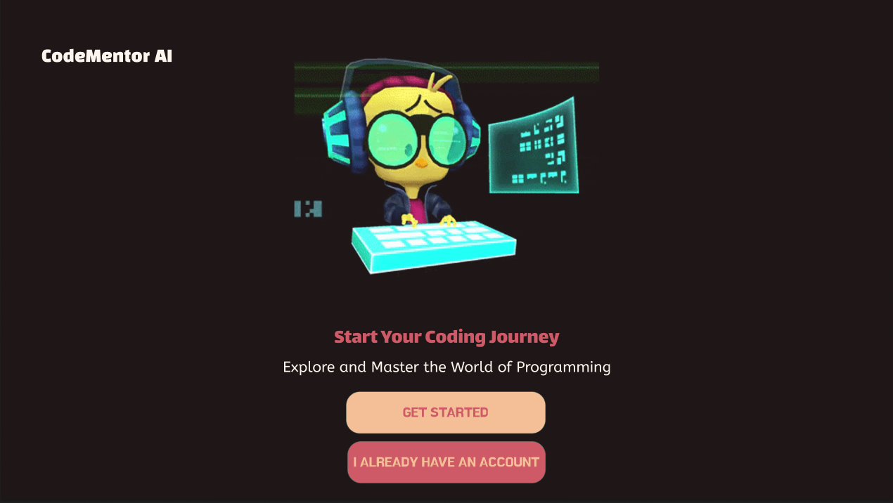

# TeamPines

CMPT 276 Term project

## Project Objectives

Code Mentor AI: An Interactive Programming Learning Platform

Code Mentor AI is a cutting-edge platform designed to revolutionize how we learn programming. Leveraging advanced APIs and a sophisticated tech stack, it offers an interactive and tailored learning experience. Features include support for multiple languages, real-time code evaluation, personalized virtual tutors, and the ability to analyze code from images. Our mission is to make programming education universally accessible and adaptable to each learner's unique style, bridging the gap between concept mastery and practical application.

## Technology Stack

## Frontend:
 React.js: Chosen for its component-based architecture, JSX syntax, and easy integration with other libraries. 
 [ReactJS Tutorial](https://react.dev/learn)
 [React with API Tutorial](https://www.freecodecamp.org/news/how-to-consume-rest-apis-in-react/)
 Chakra UI: For its customizability, consistent design language, and seamless integration with React.
## Backend:
 Python: Primary language for backend to integrate with the Steamship API and other backend functionalities.
## Testing:
 Jest: A JavaScript testing framework for unit testing React components.
 Selenium: For end-to-end testing and ensuring cross-browser compatibility.
 [Jest Tutorial](https://www.digitalocean.com/community/tutorials/how-to-test-a-react-app-with-jest-and-react-testing-library)
## CI/CD:
 GitHub Actions: For its seamless integration with Git, easy configuration, and automation capabilities.
 [Jenkins with React and NPM](https://www.jenkins.io/doc/tutorials/build-a-node-js-and-react-app-with-npm/)
 [GitHub Actions](https://docs.github.com/en/actions/learn-github-actions)
## Hosting:
 Replit: For collaborative coding and rapid prototyping. [Replit](https://replit.com)
 Netlify: For hosting the frontend, given its ease of use and continuous deployment features.[Netlify](https://www.netlify.com)

## Contributors 

- Avni Kapoor : avkap007
- Gursewak Singh: gursewaktut
- Henrik Sachdeva : henriksfu
- Jiya Garg : jiyaagargg

## Set Up Instructions 

TBD

