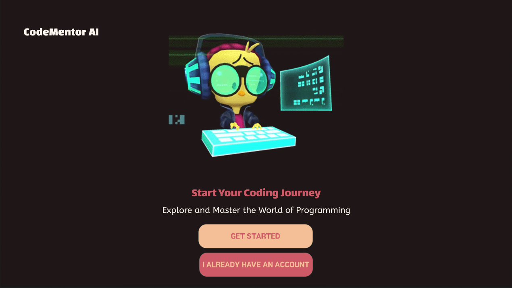

# TeamPines

CMPT 276 Term project

## Project Objectives

Code Mentor AI: An Interactive Programming Learning Platform

Code Mentor AI is a cutting-edge platform designed to revolutionize how we learn programming. Leveraging advanced APIs and a sophisticated tech stack, it offers an interactive and tailored learning experience. Features include support for multiple languages, real-time code evaluation, virtual tutors, and the ability to analyze code from digarams among other notable features. Our mission is to make programming education universally accessible and adaptable to each learner's unique style, bridging the gap between concept mastery and practical application.



## Technology Stack

## Frontend

 React.js: Chosen for its component-based architecture, JSX syntax, and easy integration with other libraries.
 [ReactJS Tutorial](https://react.dev/learn)
 [React with API Tutorial](https://www.freecodecamp.org/news/how-to-consume-rest-apis-in-react/)
 Chakra UI: For its customizability, consistent design language, and seamless integration with React.

## Backend

 Python: Primary language for backend to integrate with the Steamship API and other backend functionalities.

## Testing

 Jest: A JavaScript testing framework for unit testing React components.
 9 unit tests and 6 integration tests - all written in Jest
 [Jest Tutorial](https://www.digitalocean.com/community/tutorials/how-to-test-a-react-app-with-jest-and-react-testing-library)

## CI/CD

 GitHub Actions: For its seamless integration with Git, easy configuration, and automation capabilities.
 [GitHub Actions](https://docs.github.com/en/actions/learn-github-actions)

## Hosting

 Netlify: For hosting the frontend, given its ease of use and continuous deployment features.[Netlify](https://www.netlify.com)

## Contributors

- Avni Kapoor : avkap007
[ProjectMilestone#1_AI_Declaration_Avni_Kapoor_301446648.pdf](./extra/ProjectMilestone%231_AI_Declaration_Avni_Kapoor_301446648.pdf)
[ProjectMilestone#2_AI_Declaration_Avni_Kapoor_301446648.pdf](./extra/ProjectMilestone#2_AI_Declaration_Avni_Kapoor_301446648.pdf)

- Gursewak Singh: gursewaktut
[ProjectMilestone#1_AI_Declaration_Gursewak_Singh_301575663.pdf](./extra/ProjectMilestone%231_AI_Declaration_Gursewak_Singh_301575663.pdf)
[ProjectMilestone#2_AI_Declaration_Gursewak_Singh_301575663.pdf](./extra/ProjectMilestone%232_AI_Declaration_Gursewak_Singh_301575663.pdf)

- Henrik Sachdeva : henriksfu
[ProjectMilestone#1_AI_Declaration_Henrik_Sachdeva_301563572](./extra/ProjectMilestone%231_AI_Declaration_Henrik_Sachdeva_301563572.pdf)
[ProjectMilestone#2_AI_Declaration_Henrik_Sachdeva_301563572](./extra/ProjectMilestone%232_AI_Declaration_Henrik_Sachdeva_301563572.pdf)

- Jiya Garg : jiyaagargg
[ProjectMilestone#1_AI_Declaration_JIYA_GARG_301563502.pdf](./extra/ProjectMilestone%231_AI_Declaration_JIYA_GARG_301563502.pdf)
[ProjectMilestone#2_AI_Declaration_JIYA_GARG_301563502.pdf](./extra/ProjectMilestone%232_AI_Declaration_Jiya_Garg_301563502.pdf)

## Set Up Instructions

Please follow the following steps to run the app on your local environment:

```
git clone https://github.com/gursewaktut/TeamPines.git

cd TeamPines

npm install

npm start
```
